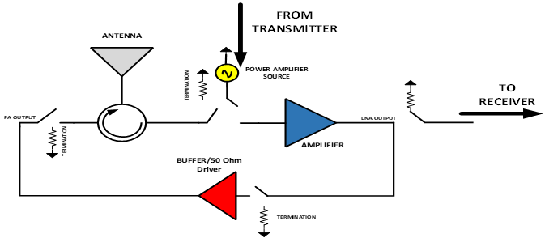
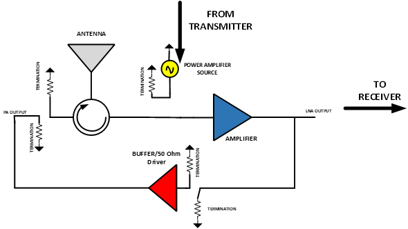
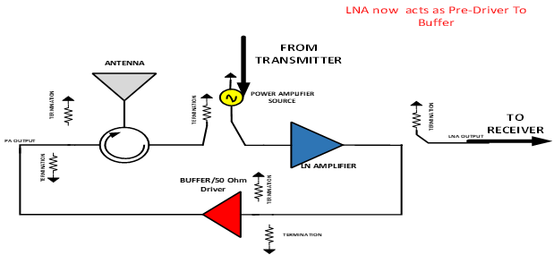
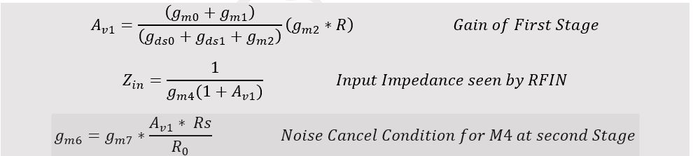
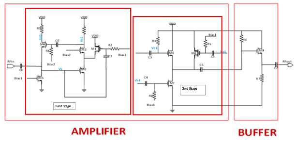
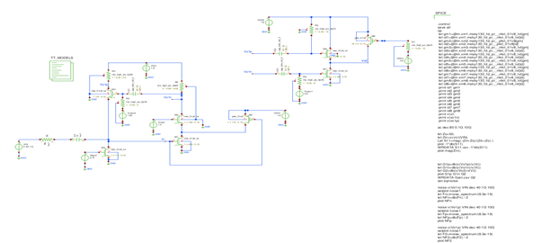
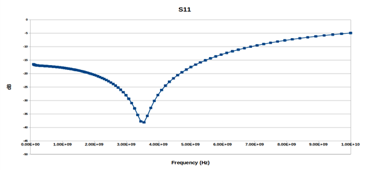

# Inductor Less Bi-Directional Amplifier for 5G

  

---

| :exclamation: Important Note            |
|-----------------------------------------|

:warning: | Use this sample project for analog user projects. 
:---: | :---

---

# Refer to docs/AMP_DOC for this project documentation in PDF. PDF version contains clearer images/graphs

# Table of Contents

[1 Introduction ](#introduction)

[2 Bi-Directional Amplification Architecture](#bi-directional-amplification-architecture)

[2.1 State of Switches During Reception](#state-of-switches-during-reception)

[2.2 State of Switches During Transmission](#state-of-switches-during-transmission)

[3 Budget Analysis ](#budget-analysis)

[3.1 Transmission Budget Analysis ](#transmission-budget-analysis)

[3.2 Reception Budget Analysis ](#reception-budget-analysis)

[4 Circuit Specifications ](#circuit-specifications)

[5 Schematic ](#schematic)

[5.1 Design Process ](#design-process)

[5.2 DC Bias Point Simulations ](#dc-bias-point-simulations)

[5.3 Two Stage Low Noise Amplifier ](#two-stage-low-noise-amplifier)

[5.3.1 Gain ](#gain)

[5.3.2 Input Matching ](#input-matching)

[5.3.3 Noise Figure ](#noise-figure)

[5.4 Complete Schematic ](#complete-schematic)

[6 Layout ](#layout)

[7 Post layout Simulation ](#post-layout-simulation)

[7.1 Noise Figure ](#noise-figure-1)

[7.2 Input Matching ](#input-matching-1)

[7.3 Voltage Gain ](#voltage-gain)

[8 Post layout Results Summary ](#post-layout-results-summary)

[9 Conclusion ](#conclusion)

[10 Design and Simulation Files ](#Design-and-Simulation-Files)

# Bi-Directional Amplifier Architecture for Sub-6 GHz 5G

PICO Design Contest Submission

# Introduction

  - TDD (Time division duplexing) RF front ends operate in such a manner
    that
    
      - During Transmission, Receiver side is isolated using and switch
        and power amplifier is driving the transmission antenna, as
        shown in Figure 1
    
      - During Reception, transmitter chain is isolated and the received
        signal from the antenna is fed to a low noise amplifier, as
        shown in Figure2

Figure 1 Transmitter on

Figure 2 Receiver on

# Bi-Directional Amplification Architecture

  - The Bi-Directional Amplifier architecture aims to exploit the
    inherent TDD nature of the classical architecture.

  - At a given time, either the power amplifier (Transmission) or the
    low noise amplifier (LNA) is working.

  - Both LNA and PA occupy silicon space and have power consumption.

  - Bi-Directional architecture makes use of a single circuit that acts
    as both the power amplifier (during transmission) and the low noise
    amplifier (during reception).

  - This way we can conserve area and power, thereby, reduce cost.

Figure 3 shows the proposed architecture of bi-directional amplification
using same amplifier and a set of switches.

Figure 3 Bi-Directional Amplifier Architecture using Switches

## State of Switches During Reception

Figure 4 shows the state of switches during the reception mode. In this
mode the amplifier acts as a low noise amplifier. The power received
from antenna is fed to the amplifier and the amplified signal is then
sent to receiver path.

Figure 4 Amplification During Reception

## State of Switches During Transmission

Figure 5 shows the state of switches during transmission. In this case
the signal from transmitter is power amplified and fed to a 50\(\Omega\)
antenna.

# Budget Analysis

A simple power budget analysis was done to get the design specifications
for the circuit.

## Transmission Budget Analysis

  - Output Power at Antenna \(\geq\) 10dBm (WLAN standard)

  - Gain of Pre-Driver Circuit= 30 dB

  - Minimum input power level required from Power Source= -20 dBm (10dBm
    – 30dB)

  - The 50 Ohm buffer should have P1dB (out) \> 10 dBm

## Reception Budget Analysis

  - Minimum power at the antenna\(\geq\) -80 dBm (WLAN standard)

  - Gain of LNA=30 dB

  - Power of signal after LNA=-50 dBm (-80 dBm+30dB )

  - Further amplification is usually done in the IF/Baseband domain

  - The LNA should have noise Figure \(\leq 4dB\)

# Circuit Specifications

  - Since the amplifier in the loop is now acting as both the power
    amplifier and the low noise amplifier, it must have following
    characteristics

| **Specification**  | **Value**                    |
| ------------------ | ---------------------------- |
| **Gain**           | \>20 dB                      |
| **Area**           | As low as possible           |
| **Noise Figure**   | \~ 3dB                       |
| **Power**          | \~30 mW                      |
| **Linearity**      | \~-20 dBm (input referred)   |
| **Output Power**   | \~10 dBm (WLAN Applications) |
| **Input Matching** | \<-10 dB in the band         |

# Schematic

Figure 6 shows the 2-stage amplifier that is used to provide voltage
gain in the circuit. In the first stage Transistors M0 and M1 provide
transconductance. Transistor M1 also reduces current through M2 and
increases the value of Resistor and drain of M2. Due to this cascode and
current re-use technique we obtain a large voltage gain. Transistor M4
is used to provide voltage to current feedback from output to input such
that the input impedance is governed transistor M4. Transistor M5
establishes bias voltage for the gate of M0. The second stage combines
the differential output from stage 1 in such a way that the noise
contribution of transistor M4 is cancelled.

Figure 6 2-Stage Low Noise Amplifier With 50 Ohm Buffer

The equations describing the above circuits are

## Design Process

  - Optimum Size for good Noise Figure at selected bias conditions

  - Selection of feedback transistor size for input matching

  - Selection of proper size at stage two for noise cancellation

  - Output buffer to match 1/gm=50 Ohms

Figure 7 shows the schematic setup to simulate small signal noise figure
in Xschem and Ngspice. The noise response at selected size and bias is
shown in Figure 8.

Figure 7 Schematic setup to simulate small signal noise figure

Figure 8 Noise Figure Response @200u/0.15u

Since by design this noise figure will be reduced by 3\~4 dB at first
stage this size was chosen.

## DC Bias Point Simulations

To calculate bias points an Xschem Schematic was mad with all
transistors at their bias points as shown in Figure 9.

Figure 9 DC Bias Point Simulation for all transistors

## Two Stage Low Noise Amplifier

Figure 10 Xschem Schematic for two stage amplifier shown in Figure 6

### Gain

Figure 11 shows the gain vs frequency graph of 2 Stage LNA. The voltage
gain is 32 dB with the band width of 6.5 GHz.

Figure 11 Gain vs Frequency graph of 2 stage LNA

### Input Matching

Figure 12 shows the input matching characteristic of the LNA in the form
of S11. The S11\<-10 dB in the band of interest.

The S11 is estimated from ac analysis using

Figure 12 S11 of 2-Stage LNA

### Noise Figure

Figure 13 shows the small signal noise figure graph of the 2-stage LNA.

Figure 13 Noise Figure of 2-Stage LNA

## Complete Schematic

Figure 14 Complete Schematic of Bi- Directional Amplifier Architecture

# Layout

After schematic simulations, the layout was done in Magic VLSI.
Individual modules were laid out separately with clean DRC and LVS and
then were combined together. The layouts are shown in Following Figures.

Figure 15 Layout of First stage of LNA

Figure 16 Layout of Second Stage of Amplifier

Figure 17 Layout of Switches

Figure 18 Complete DRC, Antenna, LVS clean layout of Bidirectional
Amplifier

Figure 19 GDS view of complete layout in KLayout tool

# Post layout Simulation

Netlists extracted from the magic were simulated again in xschem to
verify circuit functionality post layout. The schematic symbol is shown
in Figure 20.

Figure 20 Post Layout Simulation Setup in Xschem against magic extracted
netlists

## Noise Figure

The noise figure response is shown in Figure 21. Surprisingly the noise
figure has improved. This is probably due to the fact that no parasitic
resistances were calculated at the RFIN net since we were not able to
extract resistance in magic (some issue to do with **extresist** command
not working in hierarchical designs).

Figure 21 Post layout Noise Figure Response

## Input Matching

Figure 22 shows the matching at input in the form of S11.

Figure 22 Post Layout S11 graph

## Voltage Gain

Figure 23 shows the voltage gain of the amplifier when the switches for
receiver path (LNA) are on. We can see that the gain is 25 dB as
compared to original 32dB. The 7dB loss is due to the buffer at the
output to drive 50\(\Omega\) test equipment. Also the LNA to PA
isolations is about 35 dB. The bandwidth is 4.5 GHz.

Figure 23 Post Layout Voltage Gain of LNA

Figure 24 shows the voltage gain when switches for Transmitter (PA) are
on. We can see that the voltage gain is about 27dB. The isolation
between LNA and PA is still greater than 35 dB.

Figure 24 Post Layout small signal PA Gain

However, this is really a small signal voltage gain and does not include
compression and non-linear effects of large signal saturation. Since
Ngspice does not have a PSS/Harmonic balance simulator we were not able
to do large signal analysis. However, we did plot output vs input power
using transient analysis. The 1-dB compression graph is shown in Figure
25.

Figure 25 Post layout Input Vs Output Power

# Post layout Results Summary

# Conclusion

The design is ready to be integrated in caravan chip

# Design and Simulation Files
xschem/CompleteAMP is Complete Top Level Schematic

xschem/Top_PostLayout.sch is post layout Schematic that uses xschem/TopModule.spice which was extracted from TopModule.mag using magic

mag/TopModule is TopLevel Layout file of magic

netgen/

	/Xschem_Top.spice is xschem LVS file for schematic

	/Top.spice is Magic extracted netlist for LVS (does not contain diodes and Decaps)

	/comp.out is netgen LVS comparison result

gds/TopModule.gds is magic generated gds of Top Module that is to be integradted in caravan

media/ contains all images in README file

docs/AMP_DOC.pdf contains design documentation in pdf form

